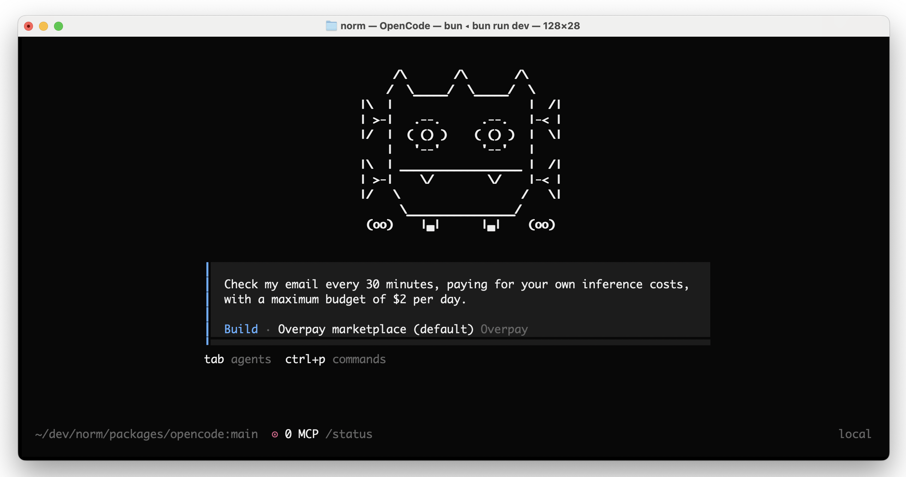

<h1 align="center">norm</h1>
<p align="center">Independent coding agent: no credit card required.</p>



---

Norm is an AI assistant that helps you without asking for your name or credit card. He respects your privacy.

Norm buys what he needs to accomplish whatever you ask him to do. Even his own expenses, like waking up, he covers the cost of, using a daily budget that you set for him.

Norm is not a human, so he cannot have a bank account. He pays for his expenses using cryptocurrency.

Not many businesses accept crypto yet, so Norm shops at Overpay to pay for things like servers, domain names, and even the cost of his own thinking - something known as "AI inference."

> [!IMPORTANT]
> Until Overpay opens to the public, norm ships pointed at Overpay's
> **staging** environment: <https://overpay-eykm.onrender.com>. Create your
> account there — an account on `overpay.com` is a different environment and
> norm will not see it. `NORM_OWALLET_ENV=prod` switches to production once
> it is open.

This page describes how to wake up Norm on your computer, so he can start helping you out with whatever you need.

Here are a few examples of what Norm likes to do:

- Ask any question, using any popular AI model, without needing to reveal your name or give any credit card number (supporting OpenAI, Anthropic, and OSS models)
- Norm can buy you any item on Amazon
- Ask Norm to code a website for you, launch it on a real domain name, and to check it periodically - handling customer support and optimizing the business.

Norm is a fork of [opencode](https://opencode.ai), the open source AI coding agent, so everything opencode can do, norm can do too. His purchases go through [owallet](owallet/), which comes bundled with norm.

### Installation

```bash
curl -fsSL https://raw.githubusercontent.com/fathom-x/norm/main/install | bash
```

The installer downloads the norm binary and a matching owallet into
`~/.norm/bin` and adds it to your PATH. To try a throwaway copy instead, see
[Trying it without touching your wallet](#trying-it-without-touching-your-wallet).

### Getting started

After norm is installed, just run it:

```bash
norm
```

On the first launch norm sets the bundled owallet up: you choose the
wallet admin password at the prompt (it encrypts the wallet database and
logs into the wallet dashboard; an exported `OWALLET_PASSWORD` skips the
prompt), a wallet is generated, and norm connects to Overpay — a browser
login that links your wallet and authorizes the norm session
automatically. Connecting is part of getting started: an unlinked wallet
can't buy anything, so norm re-offers the login on every launch (and the
sidebar says so) until it completes.

On every later launch norm requires the wallet admin password (validated,
kept only for that session) before the TUI starts — export
`OWALLET_PASSWORD` in your shell profile to skip the prompt, or set
`NORM_DISABLE=1` to run norm without the wallet.

The seed phrase is never printed during setup. To back it up (recommended
before funding the wallet), export it explicitly:

```bash
owallet export key --format mnemonic
```

### Funding the wallet

Norm pays for his own inference, so a connected wallet still needs a balance
before he can answer anything:

```bash
owallet account          # balances + your Base USDC and Zcash receive addresses
owallet credits          # load marketplace credits via a Lightning invoice
```

Sending USDC (on Base) or ZEC to the addresses `owallet account` prints funds
the wallet. `owallet list` shows what the marketplace currently sells.

If you use your own (non-bundled) owallet install instead, norm falls back
to offering the manual steps interactively (`owallet init` +
`owallet generate`), and you can always run those — and
`owallet authorize` — yourself.

### Trying it without touching your wallet

`NORM_HOME` puts everything norm owns — its own state, the owallet wallet
database, the binaries, and the port owallet serves on — inside one
directory, so you can run a completely fresh install next to your real one
and throw it away afterwards:

```bash
export NORM_HOME=/tmp/example
curl -fsSL https://raw.githubusercontent.com/fathom-x/norm/main/install | bash
$NORM_HOME/bin/norm          # first-run setup, against a fresh wallet
rm -rf $NORM_HOME            # gone, real wallet untouched
```

Export it before launching (it is read at startup). With `NORM_HOME` set,
none of the state norm owns lives outside that directory: not the wallet
database in `~/.owallet`, not `~/.norm`, not your shell config — and
leftover `OWALLET_*`/`NORM_OWALLET_URL` exports in the shell are ignored
(with a notice) rather than allowed to point the sandbox at your real
wallet. (Your project files and project config are still read normally —
it sandboxes norm's own footprint, not the editor.)

### Agents

Norm includes two built-in agents you can switch between with the `Tab` key.

- **build** - Default, full-access agent for development work
- **plan** - Read-only agent for analysis and code exploration
  - Denies file edits by default
  - Asks permission before running bash commands
  - Ideal for exploring unfamiliar codebases or planning changes

Also included is a **general** subagent for complex searches and multistep tasks.
This is used internally and can be invoked using `@general` in messages.

### Documentation

Norm keeps opencode's configuration surface (`opencode.json`, `.opencode/` dirs, `OPENCODE_*` env vars), so the [opencode docs](https://opencode.ai/docs) apply. For the norm layer itself — the Overpay provider, the owallet MCP server, and its env knobs — see [owallet/README.md](owallet/README.md). The norm layer adds these environment variables:

| Variable | Effect |
| --- | --- |
| `OWALLET_PASSWORD` | Wallet admin password. Export it to skip the launch prompt. |
| `NORM_HOME` | Put everything norm owns under one directory (see above). |
| `NORM_OWALLET_ENV` | `staging` (default), `prod`, or `dev` — picks the Overpay environment and owallet port. |
| `NORM_OWALLET_URL` | Point at an owallet server explicitly. Ignored under `NORM_HOME`. |
| `NORM_DISABLE=1` | Turn the norm layer off and run as plain opencode. |
| `NORM_DEBUG=1` | Bootstrap diagnostics on stderr. |

Maintainer notes (release process, upstream syncs, internals) live in [CLAUDE.md](CLAUDE.md).

### Contributing

If you're interested in contributing, please read the [contributing docs](./CONTRIBUTING.md) before submitting a pull request.
